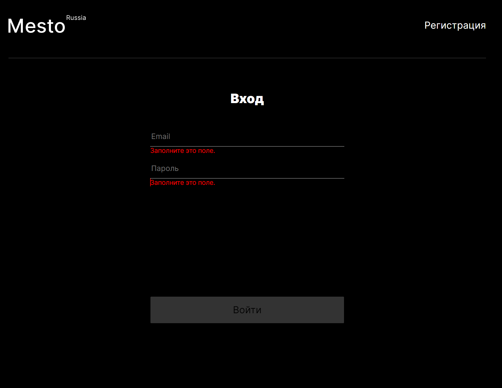
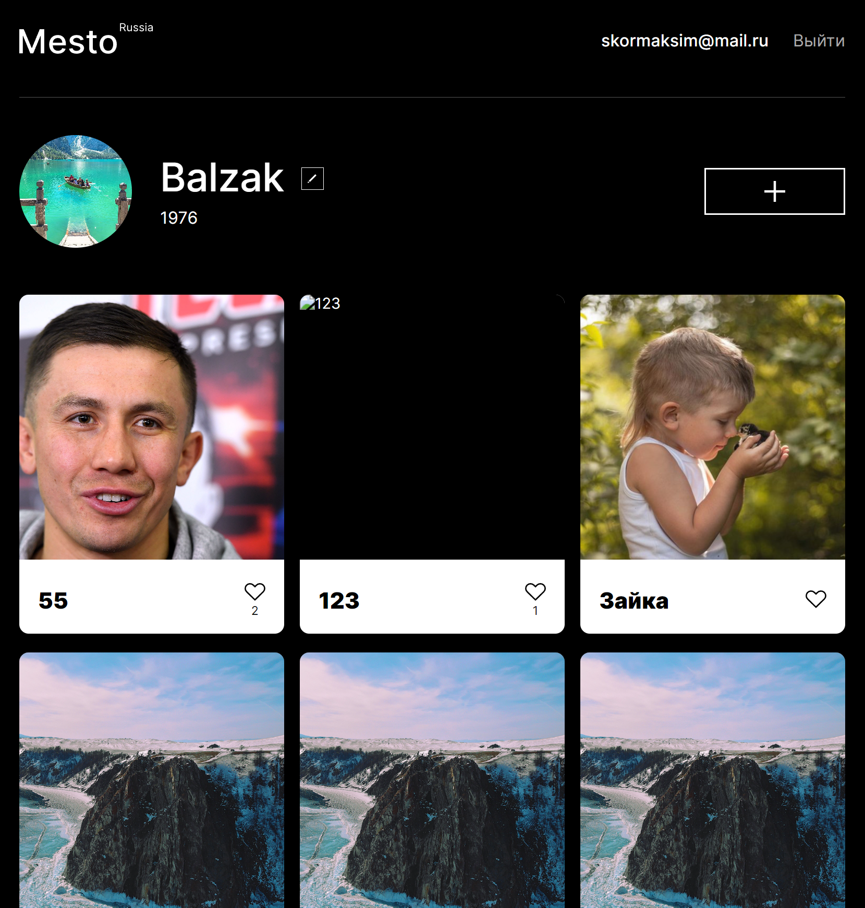

# Проект: REACT-MESTO-AUTH


#### Ссылка на сайт: https://balzak1976.github.io/react-mesto-auth/


## Описание и функциональность проекта

- Сверстаны компоненты авторизации регистрации и модального окна, который информирует пользователя об успешной (или не очень) регистрации
- Регистрация и авторизация осуществляется через бэкенд
- Настроена работ с localStorage так, чтобы токен сохранялся в нём и использовался при работе с сайтом. При повторном визите, пользователь не авторизуется
- Сверстано бургер-меню для мобильной версии


Авторизация | Основная страница | Карточки
:---: | :---: | :---: |
| | | 


## Стэк технологий

| <a href="https://html.spec.whatwg.org/multipage/" target="_blank" rel="noreferrer"></a> | <a href="https://www.w3schools.com/css/" target="_blank" rel="noreferrer"></a> | <a href="https://react.dev/" target="_blank" rel="noreferrer"></a> | 
| :---: | :---: | :---: |
| HTML | CSS  | React | 

<br>


## Запуск проекта

клонировать репозиторий 

```javascript
git clone https://github.com/Balzak1976/react-mesto-auth.git
```

установить зависимости

```javascript
npm ci 
```
запуск проекта в режиме разработки ( адрес: `http://localhost:3000` )

```javascript
npm run start 
```
создать финальную сборку ( папка `build` )

```javascript
npm run build 
```
<br>

[**Сайт свёрстан по макету Figma**](https://www.figma.com/file/5H3gsn5lIGPwzBPby9jAOo/Sprint-14-RU?node-id=0%3A1)

[**Сайт выполнен на курсе Яндекс Практикум**](https://practicum.yandex.ru/profile/web/)